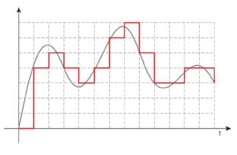

# Autores:
* Juan Diego Alvarez Beltran
* Nicola Rodriguez Diaz

# Discretización de controladores analógicos
La discretización convierte un sistema de control analógico continuo en uno digital, buscando la equivalencia del espacio de Laplace en el espacio Z, utilizando diferentes métodos que permiten hallar los valores de la función discreta.

## 1. Método de invarianza al impulso
Es una técnica utilizada en la conversión de sistemas continuos a sistemas discretos, asegurando que la respuesta al impulso del filtro digital sea igual a la del filtro analógico, escalada por la tasa de muestreo, es decir que al aplicar un impulso la salida del sistema es igual a la función de transferencia.

$$C(z) = TZ\left\lbrace\mathcal{L}^{-1}\{C(s)\} \mid_{t=KT} \right\rbrace$$
### 💡 Ejemplo 1
$$C(s) = \frac{5s + 7}{s^2 + 4s + 3}$$

**Aplicando fracciones parciales:**

$$C(s)=\frac{5s + 7}{(s + 1)(s + 3)} = \frac{1}{s + 1} + \frac{4}{s + 3}$$

**Transformada inversa de Laplace:**

$$\mathcal{L}^{-1}\{C(s)\}=e^{-t} + 4e^{-3t}$$

**Discretizar la función:**

$$\mathcal{L}^{-1}\{C(s)\}\mid_{t=kT}=e^{-kT} + 4e^{-3kT}$$
$$C(z)=TZ\{e^{-kT} + 4e^{-3kT}\}$$

**Resolviendo por tablas:**

$$C(z) = T\left\lbrace \frac{z}{2z - 1} + \frac{4z}{4z - 1}\right\rbrace$$

### Ventajas
* Preserva la forma de la respuesta del sistema analógico
* es simple de implementar
### Desventajas
* Puede haber problemas en los datos si la tasa de muestreo no es suficientemente alta.
* No siempre preserva la estabilidad del sistema original

## 2. Método de invarianza al paso
Se refiere a un método en el que se asegura que la respuesta al escalón del sistema discreto sea igual a la del sistema continuo.
Este método es menos común que la invarianza de impulso y se utiliza principalmente en aplicaciones donde la respuesta al escalón es más crítica que la respuesta al impulso.

$$C(z) = \frac{z-1}{z}Z\left\lbrace\mathcal{L}^{-1} \left\lbrace C(s) \frac{1}{s} \right\rbrace\right\rbrace$$

### 💡 Ejemplo 2
$$C(s) = \frac{1}{s^3 + 6s^2 + 11s + 6}$$

**Dividir por s para aplicar el escalón:**

$$\frac{C(s)}{s} = \frac{1}{s(s^3 + 6s^2 + 11s + 6)}$$

**Aplicando fracciones parciales:**

$$\frac{C(s)}{s} = \frac{1}{6s} - \frac{1}{2(s+1)} + \frac{1}{2(s+2)} - \frac{1}{6(s+3)}$$

**Transformada inversa de Laplace:**

$$\mathcal{L}^{-1}\left\lbrace\frac{C(s)}{s}\right\rbrace = \frac{1}{6} - \frac{1}{2}e^{-t} + \frac{1}{2}e^{-2t} - \frac{1}{6}e^{-3t}$$

**Resolviendo por tablas:**

$$Z\left\lbrace\mathcal{L}^{-1}\left\lbrace\frac{C(s)}{s}\right\rbrace\right\rbrace=\frac{1}{6} \cdot \frac{z}{z-1} - \frac{1}{2} \cdot \frac{z}{z - e^{-1}} + \frac{1}{2} \cdot \frac{z}{z - e^{-2}} - \frac{1}{6} \cdot \frac{z}{z - e^{-3}}$$

**Por definición:**

$$C(z)=\frac{z-1}{z}\left\lbracefrac{1}{6} \cdot \frac{z}{z-1} - \frac{1}{2} \cdot \frac{z}{z - e^{-1}} + \frac{1}{2} \cdot \frac{z}{z - e^{-2}} - \frac{1}{6} \cdot \frac{z}{z - e^{-3}}\right\rbrace$$

$$C(z)=\frac{z^4 - 6z^3 + 11z^2 - 6z}{6(z - e^{-1})(z - e^{-2})(z - e^{-3})}$$

### Ventajas
* Asegura que la respuesta del sistema discreto sea idéntica a la del sistema continuo en los instantes de muestreo.
* Al mantener la invarianza en los puntos de muestreo, se garantiza que las características dinámicas del sistema original se conserven en el sistema discretizado
### Desventajas
* Puede no ser adecuado para sistemas con altas frecuencias de muestreo, ya que no siempre preserva las características de alta frecuencia del sistema continuo.
* La aplicación de este método a sistemas no lineales puede ser complicada y no siempre proporciona resultados precisos.
## 3. Euler hacia adelante
Este método avanza desde un punto inicial (t_0, y_0) utilizando la pendiente de la función en ese punto para estimar el valor en el siguiente punto
**Para entender el modelo matemático, se parte desde la aproximación discreta de la derivada:**
$$\frac{d}{dkT}x(kT)=\frac{x(k+1)-x(k)}{T}$$
**Al aplicar la transformada Z se obtiene:**
$$Z\left\lbrace\frac{x(k+1)-x(k)}{T}\right\rbrace=\frac{zX(z)-X(z)}{T}=\frac{z-1}{T}X(z)$$
**Sabiendo la transformada de Laplace de una derivada:**
$$\mathcal{L}\left\lbrace \frac{d}{dx}x(t)\right\rbrace=sX(s)$$
**Se pueden aproximar las dos transformadas:**
$$sX(s)\approx\frac{z-1}{T}X(z)$$
**Suponiendo que:**
$$X(s)=X(z)$$
**Se obtiene:**
$$s\approx\frac{z-1}{T}$$
Cabe aclarar que un controlador estable en tiempo continuo no necesariamente va a ser estable en tiempo discreto.

## 4. Euler hacia atrás
A diferencia del caso anterior este método retrocede desde un punto inicial (t_0, y_0) utilizando la pendiente de la función en ese punto para obtener el valor en el punto anterior, ya no se estima el valor.
**Para entender el modelo matemático, se parte desde la aproximación discreta de la derivada:**
$$\frac{d}{dkT}x(kT)=\frac{x(k)-x(k-1)}{T}$$
**Al aplicar la transformada Z se obtiene:**
$$Z\left\lbrace\frac{x(k)-x(k-1)}{T}\right\rbrace=\frac{X(z)-z^{-1}X(z)}{T}=\frac{1-z^{-1}}{T}X(z)$$
**Sabiendo la transformada de Laplace de una derivada:**
$$\mathcal{L}\left\lbrace \frac{d}{dx}x(t)\right\rbrace=sX(s)$$
**Se pueden aproximar las dos transformadas:**
$$sX(s)\approx\frac{1-z^{-1}}{T}X(z)$$
**Suponiendo que:**
$$X(s)=X(z)$$
**Se obtiene:**
$$s\approx\frac{1-z^{-1}}{T}$$
**Al multiplicar por z en el numerador y denominador se obtiene:**
$$\frac{z}{z}\cdot\frac{1-z^{-1}}{T}=\frac{z-1}{Tz}$$
**Entonces:**
$$s\approx\frac{z-1}{Tz}$$
En este método un controlador estable en tiempo continuo es estable en tiempo discreto

## 5. Método trapezoidal "Tustin"
Este método preserva la estabilidad del sistema y mapea cada punto de la respuesta en frecuencia del filtro continuo a un punto correspondiente en la respuesta en frecuencia del filtro discreto
**Su formula básica es:**
$$s=\frac{2}{T}\cdot\frac{1-z^{-1}}{1+z^{-1}}$$
**También puede ser:**
$$z=\frac{1+\frac{Ts}{2}}{1-\frac{Ts}{2}}$$

## 6. Ejercicios
### 📚 Ejercicio 1
Convertir la siguiente función continua a función discreta por medio del método de Euler hacia adelante.
$$ G(s) = \frac{1}{s+2} $$
**Solución**
Recordar que:
$$ s \approx \frac{1 - z^{-1}}{T} $$
Se asume el periodo de muestreo $(T)$ como $T=1$, y se sustituye el valor de $s$ a su aproximación.

$$ G(s) = \frac{1}{s+2} \approx \frac{1}{\frac{1 - z^{-1}}{1} + 2} = \frac{1}{1 - z^{-1} + 2} = \frac{1}{3 - z^{-1}} $$

Ahora se multiplica el numerador y denominador por $z$ para obtener la función discreta.
$$ G(z) = \frac{z}{3z - 1} $$

### 📚 Ejercicio 2
Convertir la siguiente función continua a función discreta por medio del método de Euler hacia atrás.

$$ G(s) = \frac{s + 3}{s^2 + 4s + 5} $$

Recordar que:
$$ s \approx \frac{z-1}{Tz}$$
Se asume el periodo de muestreo $(T)$ como $T=1$, y se sustituye el valor de $s$ a su aproximación.

$$ G(s) = \frac{s + 3}{s^2 + 4s + 5} \approx \frac{\frac{z-1}{z} + 3}{\left\lbracefrac{z-1}{z}\right\rbrace2 + 4\left\lbracefrac{z-1}{z}\right\rbrace+ 5} $$

Simplificando el numerador y el denominador:

$$ G(z) = \frac{\frac{z-1}{z} + 3}{\frac{(z-1)^2}{z^2} + 4\frac{z-1}{z} + 5} = \frac{z-1 + 3z}{(z-1)^2 + 4z(z-1) + 5z^2} $$

$$ G(z) = \frac{z-1 + 3z}{z^2 - 2z + 1 + 4z^2 - 4z + 5z^2} = \frac{4z - 1}{10z^2 - 6z + 1} $$
Ahora se multiplica el numerador y denominador por $z^2$ para obtener la función discreta.

$$ G(z) = \frac{4z^3 - z^2}{10z^2 - 6z + 1} $$

## 7. Conclusiones
* Existen varios métodos que permiten convertir funciones continuas en funciones discretas, pero no todos son efectivos, dependiendo de la complejidad de la función.
* Se debe tener en cuenta el tiempo de muestreo, debido a que entre menor sea dicho tiempo más precisa será la respuesta.
* Obtener una respuesta idéntica al sistema original requiere más cálculos y puede llegar a ser más complejo.

## 8. Referencias
[Método de invariancia de impulso para la conversión de filtros analógicos a digitales - MATLAB impinvar - MathWorks América Latina](https://la.mathworks.com/help/signal/ref/impinvar.html)

[(Microsoft Word - TEMA 4 DISE\321O DE FILTROS IIR) (uv.es)](http://ocw.uv.es/ingenieria-y-arquitectura/filtros-digitales/tema_4_diseno_de_filtros_iir.pdf)

[Microsoft PowerPoint - TEMA6 (upc.edu)](https://upcommons.upc.edu/bitstream/handle/2117/6123/TEMA6.pdf)

[Invarianza de medición: su importancia en psicología y algunas direcciones futuras para su uso (medicionpsicologica.com)](https://medicionpsicologica.com/2020/07/10/invarianza-de-medici%C3%B3n-su-importancia-en-psicolog%C3%ADa-y-algunas-direcciones-futuras-para-su-uso/)

[10.2: Método Euler hacia delante - LibreTexts Español](https://espanol.libretexts.org/Fisica/F%C3%ADsica_Matem%C3%A1tica_y_Pedagog%C3%ADa/F%C3%ADsica_Computacional_(Chong)/10%3A_Integraci%C3%B3n_Num%C3%A9rica_de_ODEs/10.02%3A_M%C3%A9todo_Euler_hacia_delante#:~:text=El%20M%C3%A9todo%20Adelante%20Euler%20consiste%20en%20la%20aproximaci%C3%B3n,%E2%86%92%201%2C%20y%20%E2%86%92%202%2C%20y%20as%C3%AD%20sucesivamente.)

[10.3: Método de Euler Hacia Atrás - Física LibreTexts](https://phys.libretexts.org/Bookshelves/Mathematical_Physics_and_Pedagogy/Computational_Physics_(Chong)/10:_Numerical_Integration_of_ODEs/10.03:_Backward_Euler_Method)

[Discretizacin de reguladores continuos en representacin interna: mtodo de Tustin (upv.es)](https://personales.upv.es/asala/DocenciaOnline/Video/drsst.html)

[Aproximacion de Controladores - Proyecto (unam.edu.ar)](https://aulavirtual.fio.unam.edu.ar/pluginfile.php/86838/mod_folder/content/0/Aproximacion%20de%20Controladores%20-%20Proyecto.pdf)

[Transformación bilineal o transformación de Tustin | La libreta de Gastón (ghsalazar.github.io)](https://ghsalazar.github.io/2021/03/07/transformaci%C3%B3n-bilineal.html)