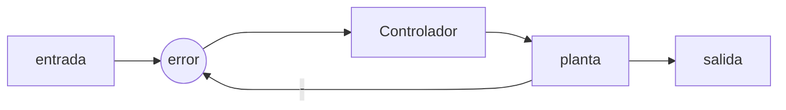
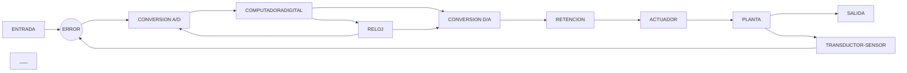

# Autores:
* Juan Diego Alvarez Beltran 120688
* Nicolas Rodriguez Diaz 112572
* # INTRODUCCION CONTROL DIGITAL 
El control digital es un sistema de tiempo  discreto, solo puede tomar 2 posibles estados a diferencia del analogo que puede tomar cualquier valor a traves del tiempo.
> ### DIFERENCIAS DEL CONTROL DIGITAL Y EL ANALOGO
> 1. En cuanto a la exactitud tiene mayor exactitud el control analogo 
> 2. En cuanto a los errores de implementacion es mejor el control digital
> 3. En cuanto a la velocidad el control analogico es mas rapido, el control digital se debe procesar

###  Estructura de un controlador analogico

## Estructura de un controlador digital

## Conversion analogo digital 
1. Muestreo: Se realiza un muestreo cada cierto tiempo, es decir que no se convierte toda la señal y el intervalo de tiempo se realiza en segundos, por lo tanto se mide en Hz
- Al realizar una alta tasa del muestreo se puede obtener mas informacion de la señal, por ende si no se realiza una buena tasa de muestreo se perdera demasiada informacion y no sera fiel a la señal 
-  La tasa de muestreo debe ser periodica "tiempo fijo"
2. Cuantización: La senal analogica se conviertio en una serie de valores que corresponden a cada una de los valores tomados en la relizacion del muestreo
3. Codificación: Se asignan valores binarios a cada una de las muestras obtenidas y a estos les corresponde un valor unico, tambien se determinan la cantidad de bits que se utilizaran para evitar desperdiciar memoria 
## Ejercicios
💡
Señal : $0v-3v$
bits de represnetación = 2 bits 
$$ 2^{2}= 4 $$ posibles simbolos que pueden tomar valores
Rango analogico  $3-0 = 3v$
Representacion $$\frac {3}{4}=0.75v$$
| voltaje |representacion  |
|--|--|
|  0| 00 |
|  0.75v|  01|
|  1.5v|  10|
|  2.25v|  11|

## Ejemplo de realizacion de bits

📚Ejemplo 1

Señal : $0-7 v$
Bits de representación = 2 bits
$$2^{10}=1024$$ Cantidad de bits que realizaran la representación o cantidad de simbolos que puede tomar el muestreo 
Rango analogico : $7-0 =7$
representacion :$$\frac{7}{1023} = 0,006842619$$ Es la variacion del voltaje en el que se realizara cada muestreo $2^{10}-1=1023$

📚Ejemplo 2

Señal : $0-5 V$
Bits de representación = 2 bits
$$2^{4}=16 $$ Cantidad de bits que realizaran la representación o cantidad de simbolos que puede tomar el muestreo 
Rango analogico : $5-0 =5$
representacion : $$\frac{5}{15} = 0,3333333$$ Es la variacion del voltaje en el que se realizara cada muestreo $2^4-1=15$
| VOLTAJE | VALOR |
|---------|-------|
| 0       | 0000  |
| 0.3333  | 0001  |
| 0.6666  | 0010  |
| 0.9999  | 0011  |
| 1.3333  | 0100  |
| 1.6666  | 0101  |
| 1.9999  | 0110  |
| 2.3333  | 0111  |
| 2.6666  | 1000  |
| 2.9999  | 1001  |
| 3.3333  | 1010  |
| 3.6666  | 1011  |
| 3.9999  | 1100  |
| 4.3333  | 1101  |
| 4.6666  | 1110  |
| 5       | 1111  |
___
##	Conversion digital analogica
De igual manera se genera una correspondencia entre los valores digitales y analogicos 

### Metodos de conversión
Por lo general existen 2 tipos de conversión 

### Resistencias ponderadas

1. - Resistencias ponderadas que es facil de configurar pero es inexacto.

para calcular el voltaje de salida de las resistencias ponderadas se tiene la siguiente ecuación 

$$ Vo= -Rf(\frac{V1}{R}+\frac{V2}{2R}+\frac{V3}{4R}+...\frac{Vn}{R^N})$$

Donde los valores de las resistencias se deben tomar en orden de K para evitar posibles errores
La cantidad de bits o numeros de circuitos que se encuentren cerrado indicara el bit que se estara representando, es decir que si solo se encuentra el bit N° 2 cerrado se indicara el valor 0100 que se representara de la siguiente manera 
$$ Vo= -Rf(\frac{0}{R}+\frac{V2}{2R}+\frac{0}{4R}+...\frac{0}{R^N})$$

asi indicaremos que es el valor 0100 el que se esta representando en las resistencias ponderadas

### Red escalera R2R
2. - R2R que es mas complicado pero mas exacto

para calcular el valor del voltaje tenemos la siguiente ecucacion

$$ Vo= -(\frac{Rf}{R})(\frac{V1}{16}+\frac{V2}{8}+\frac{V3}{4}+\frac{V4}{2})$$

## Modelo matematico 

> Para ambos tipos de conversores se manejan los mismos componentes (muestreador, retenedor) estas realizan operaciones opuestas 
> hay que tener unas consideraciones que ocurren en el modelo ideal como que la entrada debe ser de igual magnitud que la salida 
> la conversion se demora en relizarse, pero para las consideraciones se debn tomar como si se hicieran de manera instantanea
>Estos sistemas utilizan un ZERO ORDER HOLD 
>

# Concluciones 
1. Para la conversion de las señales Analogicas a digitales como digitales analogicas es necesaria una buena implementacion de los componentes (amplificadores operacionales, valores de las resistencias).
2. En el metodo de las resistencias ponderadas es muy importante trabajar con resistencias de presicion debido a la gran variedad de resistencias que se manejan, a diferencia del r2r que solo maneja 2 valores de resistencias 
3. el metodo r2r tiende a ser mas presico y estable por lo nombrado anteriormente, solo el uso de dos valores de resistencia 
# Referencias
1. https://www.ecured.cu/Conversi%C3%B3n_Digital_Anal%C3%B3gica
2. [Qué Es El Convertidor Analógico-digital Y Su Funcionamiento - Electrositio](https://electrositio.com/que-es-el-convertidor-analogico-digital-y-su-funcionamiento/)
3. [Conversor digital-analógico | How it works, Application & Advantages (electricity-magnetism.org)](https://www.electricity-magnetism.org/es/conversor-digital-analogico/)