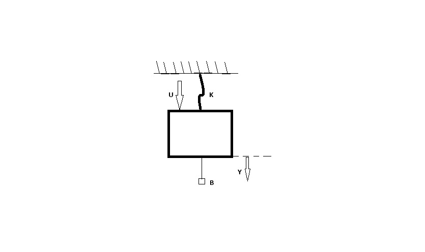

# Nicolas Rodriguez Diaz 112572
# Juan Diego Alvarez Beltran 120688

# Espacio de Estados

- El espacio de estados es una representacion matematica de los sistemas de control dinamicos es decir de los sistemas de control que no sol lineales en las entradas y las salidas (variantes en el tiempo, no lienales), esta representacion matematica considera ademas de las entradas y salidas otras variables que nos ayudan a representar de manera dinamica los sistemas, sin embargo que halla una representacion matematica no siempre significa que halla una solucion implicita, se puede represnetar cualquier tipo de sistema pueden ser de multiples entradas y multiples salidas.

- Las variables de estado seran las encargadas de determinar el comportamiento del sistema, y aunque tengan una representacion matematica no necesariamente indica que sean variables medibles, el conjunto de estas variables de estado nos permiten conocer por completo el comportamiento del sistema es decir el estado del sistema, la relacion interna de cada una de estas variables cambiara el comportamiento del sistema, es decir que la afectacion de solo una de estas variables nos cambiara el estado de la planta.

- Para esta representacion matematica son utilizadas las ecuaciones de estado que surgen al momento de combinar las variables de estado con operaciones matematicas, esta union nos genera varias ecuaciones por lo general se represnetan con ecuaciones diferenciales que no se resolveran si no que se trabajara con sus parametros, la combinacion de estas ecuaciones generan un espacion geometrico que se denomina espacio de estados. 

### Representacion matematica

Esta es la representacion matematica  para las ecuaciones de estado:

#### Entradas
$$U_{1}(k),U_{2}(k),... ,U_{r}(k)$$
- como se indicaba anteriormente se pueden tener varias entradas  en este caso podriamos tener $U_{r}$ de entradas

#### Salidas
$$y_{1}(k),y_{2}(k)...y_{m}(k)$$ 
- De igual manera se indicaba que podiamos tener varias salidas en este caso $y_{m}$ de salidas 

####  Variables  de estado 
$$x_{1}(k),x_{2}(k),...,x_{n}(k)$$
- Las cantidad de variables de estado dependera de la planta que estemos trabajando, pero siempre se debentener la misma cantidad de variables de estado como ecuaciones de estado

#### Ecuacuaciones de estado 
$$x_{n}(k+1)= f_{n}(x_{1}(k),x_{2}(k).... x_{n}(k),U_{1}(k),U_{2}.... U_{r}(k))$$

- Donde tendremos una funcion $f_{n}$ que nos relacionara todas las variables de estado con todas nuestras entradas. Tendremos $x_{n}(k+1)$ donde n sera la cantidad la misma cantidad de variables de estado como ecuaciones 

#### Salidas ecuaciones de estado 

$$y_{m}(k)=g_{m}(x_{1}(k),x_{2}(k),x_{a}(k),..., x_{n}(k),u_{1}(k),u_{2}(k)....u_{r}(k))$$
- vamos a tener tantas ecuaciones de salida como salidas que tenga nuestro sistema, tambien tendremos nuestra funcion $g_{m}$ que nos representara la relacion entre las variables de estado con las entradas.

De forma general se podrian expresar las ecuaciones de estado como:

variables de estado.
$$X(k+1)=f(x(k),u(k),k)$$ 

$$Y(k)=g(x(k),u(k),k)$$

La represnetacion de $X, u, Y, x$ nos representaran matrices ya que son varias ecuaciones de estado

- Las caracteristicas de el espacio de destados es que las funciones f y g pueden ser variantes en el tiempo, es decir que son funciones dependientes del tiempo.

De esta manera podemos trascribir nuestras variables de estado a matrices para una mejor representacion, quedandonos de la sigueinte manera:

$$X(k+1)=A(k)X(k)+B(k)u(k)$$

Donde nuestra matriz $A$ seran nuestras funciones que dependeran del tiempo, 
$X$ seran nuestras variables de estado y es mas representado como un vector,$B$ tambien sera una matriz que depende de el timepo, $U$ seria el vector de entradas, en nuestras matrices $A$ y $B$ podrian haber funciones no lineales como senos, cosenos etc..

$$Y(k)=C(k)X(k)+D(k)U(k)$$

Donde nuestra matriz $C$ tambien seran funciones no lineales dependientes del tiempo, $X$ seran de igual manera nuestras variables de estado, $D$ matriz con funciones que dependen del tiempo y $U$ que sera la representacion de nuestras entradas.

- Esta sera la representacion mas compleja, por este motivo se deben realizar una serie de simplificaciones o limitaciones de nuestro modelo.

1. Limitar las funciones $f$,$g$ seran funciones leniales y no dependeran del tiempo.

de esta manera nuestras matrices $A$,$B$ dejaran de ser dependientes del tiempo $K$ y dejaran de contener funciones y ahora solo se tendran constantes lo que simplificara quedandonos de la siguiente manera:

$$X(k+1)=AX(k)+Bu(k)$$
$$Y(k)=CX(k)+Du(k)$$

$A$ sera la matriz de estados
$B$ sera la matriz de entrada
$C$ sera la matriz de salida
$D$ sera la matriz de transmision directa , muestra las relaciones directas entre las entrades y salidas, estas relaciones se ven en los sistemas multivariados

# Ejemplo 💡

Teniendo en cuenta el siguiente problema de masa resorte amortiguador:

Realizando el diagrama de fuerzas de este problema:

Donde la fuerza $u$ es la encargada de sacar del reposo el sistema, por ende nuestro resorte $k$ se expandira y por la reaccion del mismo ejercera una fuerza en sentido contrario a $u$ para volver a su estado normal, y teniendo en cuenta que nuestro amortiguador $B$ siempre se opone a la fuerza del movimiento a la que se le esta aplicando $u$ 

- Realizamos la sumatoria de fuerzas: $$U(t)-F_{k}-F_{B}= m*a$$ de esta manera nos toca representar nuestro $F_{k}$ para esto aplicamos la ley de hooke que nos indica la representacion de la fuerza del resorte de la siguiente manera $$F_{k}= k*x$$ donde x sera la distancia o la elongacion del resorte y k sera la constante de elongacion del resorte, como en este caso la elongacion del resorte corresponde a la posicion de nuestra masa $m$, la fuerza de nuestro amortiguador $F_{B}$se puede representar como $$F_{B}=B*\frac{dx}{dt}$$ donde B sera la constante de friccion y  podemos decir lo siguiente:
 $$U(t)-Ky(t)-By'(t)= m*y´´(t)$$ 

De esta manera obtenemos nuestra ecuacion diferencial que sera representada en espacio de estados para esto realizamos los siguientes pasos.
1. discretizacion de la ecuacion diferencial,  discretizando las dereivadas.

$$\frac{d}{dkT}*x(kT)=\frac{x(k+1)-x(k)}{T}$$

Quedando de la siguiente manera:
$$MY(k+2)+(BT-2M)Y(k+1)+(M-BT+T^{2}K)Y(K)=U(k)T^{2}$$

Pasamos de una ecuacion diferencial a una ecuacion en diferencia, ahora realizamos los siguientes pasos:
1. Despejar el maximo adelanto de la ecuacion en diferencias ($k+2$) 
$$MY(k+2)+(BT-2M)Y(k+1)+(M-BT+T^{2}K)Y(K)=U(k)T^{2}$$
$$MY(k+2)=-(BT-2M)Y(k+1)-(M-BT+T^{2}K)Y(K)+U(k)T^{2}$$
2. igualar la salida a la variable de estado
$$M_{y}(k)= x_{1}(k)$$
3. desplazar sucesivamente para obtener las derivadas de las variables de estado
$$My(k+1)=x_{1}(k+1) = x_{2}(k)$$
- $$x_{1}(k+1) = x_{2}(k)$$ sera la ecuacion de estado 1
- $$x_{2}(k+1) = My(k+2)$$ sera la ecuacion de estado 2
tenemos que ir en adelantos hasta encontrar el mayor grado de la ecuacion en diferencia
4. Organizar los terminos de las ecuaciones de estado dentro de las matrices $A,B,C,D$

$$x_{1}(k+1) = x_{2}(k)$$
 $$x_{2}(k+1) = My(k+2)$$ pero como ya conocemos a que es igual $My(k+2)$ remplazamos quedando de la siguiente manera
 
$$x_{2}(k+1) =-(BT-2M)Y(k+1)-(M-BT+T^{2}K)Y(K)+U(k)T^{2}$$pero de esta manera aun no hemos expresado la ecucion en variables de estado  por lo que tendremos que remplazar $Y(k+1)$ y $Y(k)$

$$x_{2}(k+1) =-(BT-2M)x_{2}(k)-(M-BT+T^{2}K)x_{1}(k)+U(k)T^{2}$$
de esta manera ya nos queda expresa la ecuacion en terminos de variables de estado y entradas
$$x_{2}(k+1) =-(BT-2M)x_{2}(k)-(M-BT+T^{2}K)x_{1}(k)+U(k)T^{2}$$de esta ecuacion en los terminos $(M-BT+T^{2}K)$$(BT-2M)$dividimos por $M$ quedandonos de la siguiente manera 

 
$$x_{2}(k+1) =-(\frac{BT}{M}-2)x_{2}(k)-(1-\frac{BT}{M}+\frac{T^{2}K)}{M})x_{1}(k)+U(k)T^{2}$$

- Ecuacion de salida $My(k) = x_{1}(k)$ despejando de esta ecuacion $y(k)=\frac{x_{1}(k)}{M}$

### ECUACIONES DE ESTADO EN MATRIZ

$\begin{vmatrix}
x_{1}(k+1) \\ x_{2}(k+1)
\end{vmatrix}$=$\begin{vmatrix}
0 & 1 \\
-(1-\frac{BT}{M}+\frac{T^{2}K}{M}) & -(\frac{BT}{M}-2) \\
\end{vmatrix}$$\begin{vmatrix}
x_{1}(k) \\ x_{2}(k)
\end{vmatrix}$+$\begin{vmatrix}
0 \\ T{^2}
\end{vmatrix}$$U(t)$

### ECUACION DE SALIDA EN MATRIZ
$y= \begin{vmatrix}
\frac{1}{M} & 0 \\
\end{vmatrix}$$\begin{vmatrix}
x_{1}(k) \\ x_{2}(k)
\end{vmatrix}$$+[0]U$

# Ejercicio 📚

$$y(k+2)+y(k+1)+0.16y(k)=2u(k) $$
1. Despejando la maxima derivada 
$$y(k+2)= -y(k+1)-0.16y(k)+2u(k)$$
igualar la salida a las variables de estado 
$$y(k)=x_{1}(k)$$
se agregan adelantos en 1 para obtener las variables de estado 
$$y(k+1)=x_{1}(k+1)=x_{2}(k)$$
- primera ecuacion de estado

llegamos al maximo grado de la ecuacion, y habiendo despejado $y(k+2)= -y(k+1)-0.16y(k)+2u(k)$
$$y(k+2)=x_{2}(k+1)= -y(k+1)-0.16y(k)+2u(k)$$
remplazamos los valores que ya conocemos
$$y(k+2)=x_{2}(k+1)= -X_{2}(k)-0.16X_{1}(k)+2u(k)$$

ahora representamos en las matrices 
$$\begin{vmatrix}
x_{1}(k+1) \\ x_{2}(k+1)
\end{vmatrix}=
\begin{bmatrix}
0 & 1 \\
-0.16 & -1 \\
\end{bmatrix}
\begin{vmatrix}
x_{1}(k) \\x_2(k)
\end{vmatrix}+
\begin{vmatrix}
0 \\2
\end{vmatrix} u$$
$$y= 
\begin{bmatrix}
1 & 0 \\
\end{bmatrix}
\begin{bmatrix}
x_{1}(k) \\x_{2}(k)
\end{bmatrix}+
[0]u$$

# Conclusiones
- Con el espacio de estados ahora podemos representar sistemas que sean dependientes del tiempo, sistemas que tengan muchas entradas y muchas salidas
- Podemos representar de muchas maneras el espacio de estados y todas garantizar el comportamiento del sistema 
- El espacio de estados es una manera fui flexible de representar sistemas y con la representacion de sistemas con muchas entradas y salidas no lineales y variantes en el tiempo hace que sea una manera mucho mas robusta para representar sistemas 

